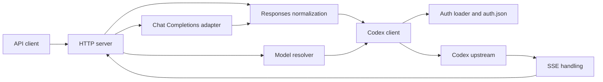

# Design

go-openai-proxy exposes a local subset of the OpenAI HTTP API using credentials
from a ChatGPT/Codex OAuth cache. Both inference endpoints call the Codex
Responses endpoint. The proxy adapts requests and responses; it does not run
models, execute tools, or store conversations. This document describes the
current implementation, including its compatibility limits. Explicitly marked
planned features describe agreed designs awaiting implementation in TODO.md.

## Architecture

| Component | Responsibility |
| --- | --- |
| `cmd/go-openai-proxy` | Parse CLI options, configure logging, check credentials, resolve startup models, start the server, and handle signals. |
| `internal/server` | HTTP routing, local model objects, request validation, Chat conversion, and downstream response writing. |
| `internal/codex` | Upstream URLs and headers, cached authentication and retry, request normalization, model aliases, and CLI identity. |
| `internal/auth` | Discover and load OAuth files, derive account identity, refresh tokens, and persist updates. |
| `internal/models` | Resolve the advertised model list and Codex version, with in-memory caches. |
| `internal/sse` | Parse SSE, collect response objects, and encode Chat stream data. |
| `internal/config` | Shared defaults and limits. |

The handler owns one Codex client and one model resolver. Authentication,
identity, and resolver caches use mutexes. Authentication loading and recovery
are serialized per client; ordinary upstream requests run concurrently. Catalog
and version fetches happen outside their cache locks, so concurrent cache misses
can perform duplicate fetches.

## Startup and configuration

Kong parses CLI and environment values directly into `server.Options`. The
README lists user-facing configuration. Defaults are applied by the server,
client, and auth loader: the listener uses `127.0.0.1:17132`, the upstream uses
`https://chatgpt.com/backend-api/codex`, and refresh uses the configured OAuth
client and token endpoint. The upstream base URL must have a scheme and host.

The CLI first locates an existing auth file and opens it for writing without
changing its contents. This check also runs with `--no-refresh`. An explicit
`--oauth-file` is the only candidate when supplied; otherwise discovery tries,
in order:

1. `$CHATGPT_LOCAL_HOME/auth.json`
2. `$CODEX_HOME/auth.json`
3. `~/.chatgpt-local/auth.json`
4. `~/.codex/auth.json`

The CLI resolves the model list before binding the listener and exits if that
fails. This startup resolver and client are separate from the handler's, so
their caches are not reused. A configured model list bypasses catalog discovery
and credential-content loading at this stage; the writable-file check still
applies. Successful startup prints the `/v1` base URL and available models.

Logging uses `log/slog` with text output on stderr, at info level by default and
debug with `-v`. SIGINT and SIGTERM cancel the application context. The server
starts a shutdown goroutine with a ten-second deadline; the CLI returns after
context cancellation rather than explicitly waiting for that goroutine. The
HTTP server has a ten-second read-header timeout. The default upstream client
is `http.DefaultClient`, without an overall request timeout; requests carry the
incoming request context.

## HTTP surface and trust boundary

| Route | Behavior |
| --- | --- |
| `GET /health` | Returns `{"ok":true,"replay_state":"stateless"}` without probing upstream. |
| `GET /v1/models` | Returns locally shaped OpenAI model objects from the resolver. |
| `GET /v1/models/{model}` | Looks up one exact ID in that same list; missing models return 404. |
| `POST /v1/responses` | Normalizes Responses input and forwards it to upstream `/responses`. |
| `POST /v1/chat/completions` | Converts Chat input to Responses and converts the output back. |
| `OPTIONS` on any path | Returns 204 with CORS headers. |
| Other method/path combinations | Return a local JSON 404; there is no generic forwarding route. |

Model objects use `created: 0` and `owned_by: "codex-oauth"`. Configured models
and exclusions affect discovery and model lookup, not authorization: inference
requests are not checked against the advertised list.

There is no inbound API-key check, TLS termination, or rate limiter. CORS allows
any origin, GET/POST/OPTIONS, and authorization/content-type headers. Network
access to the listener therefore grants access to the configured account's
inference capability. Loopback binding is the default trust boundary.

Inference bodies are buffered with a 64 MiB limit. Read and parse failures return
400. Chat requires a non-null `messages` array, but accepts an empty one; neither
endpoint performs complete upstream schema validation. Local errors use an
`error` object containing `message` and `type`. Transport, auth, catalog, and
response-collection failures generally return 502; encoding failures return
500. Non-2xx upstream inference responses preserve upstream status, headers,
and body. Response-write failures are logged.

Conversation state belongs to the caller. Every inference request forces
`store=false` and upstream `stream=true`. Responses rejects a string-valued
`previous_response_id` and top-level `input` items with `type:"item_reference"`
and a string ID. Clients must replay their history; response retrieval and
input-item listing are unavailable. This is targeted rejection, not recursive
validation of every possible replay-state shape.

## Request adaptation

### Shared Responses normalization

Responses payloads use JSON maps so fields not explicitly transformed or removed
can pass through. The normalizer:

- Converts string `input` into a user message array, or an empty array for blank
  input.
- Appends text from system/developer messages to top-level `instructions`, in
  input order, separated by blank lines. Text-only messages are removed;
  mixed-content messages remain with role `developer`. Missing or non-string
  instructions become an empty string if no promoted text replaces them.
- Converts untyped tool-role rows into `function_call_output`. This conversion
  takes an early return for that item, so newly converted rows do not also pass
  through call-ID normalization in the same traversal.
- Normalizes call IDs on recognized typed tool items to `fc_`, replacing known
  legacy prefixes. IDs longer than 64 bytes receive a deterministic SHA-256-based
  compact form. An item ID can supply a missing call ID.
- Removes replayed reasoning-item IDs and supplies an empty summary when missing
  or null. Adds `reasoning.encrypted_content` to missing or array-valued `include`
  so callers can retain encrypted reasoning state.
- Applies model suffix defaults and forces stateless upstream streaming.

The shared removal list is `chat_template_kwargs`, `frequency_penalty`,
`max_completion_tokens`, `max_output_tokens`, `metadata`, `presence_penalty`,
`prompt_cache_retention`, `safety_identifier`, `stop`, `stop_sequences`,
`stream_options`, `temperature`, `top_p`, `truncation`, and `user`.
In particular, raw Responses `max_tokens` is not in this list.

### Chat Completions adapter

Chat requests decode into a selected set of typed fields; unknown fields are
discarded. An omitted model defaults to `gpt-5.2`. User text and image URLs become
Responses content parts. Assistant text becomes output-message history, with
`reasoning_content` wrapped in `<thinking>` tags. Assistant tool calls become
function-call items; tool results become function-call outputs. Legacy
function-role results use the function name as their call ID.

Function tools and legacy `functions` become Responses tool definitions;
missing parameters default to an open object schema. Explicit `tool_choice`
takes precedence over converted legacy `function_call`. JSON object and JSON
schema response formats map to `text.format`. The adapter also forwards
`parallel_tool_calls`, `reasoning_effort`, and `service_tier` in their Responses
shapes. It does not forward Chat sampling or token-limit fields, including
`max_tokens`. Unsupported content parts may be represented as text; this is not
a general multimodal or full Chat API implementation. Tools are described and
returned to clients, never executed by the proxy.

### Model aliases

Names can end in `-<effort>`, `-fast`, or `-<effort>-fast`. Recognized efforts are
`none`, `minimal`, `low`, `medium`, `high`, `xhigh`, and `max`. The suffixes are
removed from the upstream model name and supply `reasoning.effort` and
`service_tier:"priority"` defaults. Explicit request fields take precedence;
`service_tier:"fast"` is normalized to `priority`. Alias parsing is independent
of catalog membership and does not validate a model's capabilities.

## Response adaptation and streaming

Streaming Responses callers receive the upstream body through `io.Copy` with
SSE headers. This path does not parse events or explicitly flush per event.

Non-streaming callers use the shared SSE collector, which buffers the entire
event sequence. It keeps the latest embedded response object and gathers
`response.output_item.done` items by output index. If that response has no output,
the collected items fill it in index order. Despite its name, the collector
does not require a completed status or terminal event. Malformed JSON events
are skipped; an embedded response takes precedence over a recorded error event.
No response object, or an SSE read failure, produces an error. The scanner has
a 32 MiB token limit; this is not a total-stream memory limit.

Non-streaming Chat output contains one choice, assistant text or tool calls,
a `chatcmpl_` ID, the requested model name, and converted usage. With tool calls,
message content is null. Completed responses map to `stop` or `tool_calls`,
incomplete responses to `length`, and other statuses to a null finish reason.
Input/output token counts become prompt/completion counts; detail objects are
preserved and total tokens are summed.

Streaming Chat is incremental: it emits and flushes an initial assistant role,
then text and function-argument deltas. A per-request tracker maps upstream
output indices and item IDs to stable Chat tool indices, supporting interleaved
calls. Completed tool items supply arguments only when deltas have not already
been sent. A finish reason is emitted at most once. When requested through
`stream_options.include_usage`, the last observed usage is emitted in a separate
chunk with empty choices, followed by `[DONE]`.

Chat stream error events and scanner failures are logged rather than converted
to downstream error events; the adapter still attempts its final usage and
`[DONE]` writes. Malformed JSON events are skipped. Consequently, `[DONE]` alone
does not guarantee successful upstream completion.

## Authentication and upstream identity

The auth loader reads OAuth access, ID, refresh, and account tokens plus
`last_refresh` from `auth.json`. A missing account ID is derived from the ID
token's ChatGPT auth claim. JWT payload decoding extracts metadata without
signature verification. The stored `OPENAI_API_KEY` field is not used for
upstream authentication.

With a refresh token available, automatic refresh is due when the access token
is missing, its readable expiry has passed, or the recorded refresh is more
than eight days old. There is no background refresh timer. The client checks
cached auth before requests and loads or refreshes as needed. Refresh updates
the modeled auth-file fields and writes JSON back directly; writes are not
atomic and have no cross-process lock. Newly created files use mode `0600`,
while existing permissions are retained. Unknown JSON fields are not preserved.

After an upstream 401, recovery reloads stored credentials under the client
mutex. Changed credentials for the same account trigger one retry. If unchanged,
refresh is attempted unless disabled; a different account from the reload is
not retried, and a different account after refresh is reported as an error.
Refresh persistence occurs before that latter account check. There is at most
one upstream retry, with no general transient-error retry policy.
`--no-refresh` still allows file reload and same-account retry after a 401.

Upstream requests use the configured base origin and path, replacing auth and
account headers with the loaded credentials. The client adds
`OpenAI-Beta: responses=experimental`, `Originator: codex_cli_rs`, a paired
User-Agent/version, and a session UUID. Connection-scoped headers and explicit
Accept-Encoding are removed. HTTP handlers supply their own upstream headers;
they do not forward caller authorization.

Identity is initialized lazily and cached for the client's lifetime. Its version
is validated and clamped to the compiled minimum, currently `0.144.0`; an absent
or invalid resolved version uses that fallback. The handler resolves it through
the model resolver and logs resolution failures at debug level. Startup catalog
requests use a separate client without that identity resolver.

## Model discovery

Configured model entries are trimmed, deduplicated, and filtered by exact
exclusions without a catalog request or automatic alias expansion. Otherwise,
the resolver requests `/models?client_version=...` using account credentials.
Each nonblank catalog slug contributes its base name and advertised API effort
variants. Fast and effort/Fast combinations appear only when the catalog
advertises a priority service tier or additional Fast speed tier. Excluding a
base slug removes its entire generated family; exact aliases can also be
excluded. The CLI excludes `codex-auto-review` by default.

Nonempty discovered lists are cached for five minutes. Failed refreshes return
errors rather than serving stale lists. A catalog without any usable slug is
an error; a list emptied by exclusions is allowed.

Version resolution uses an explicit override first, then installed
`codex --version`, then the npm registry's latest Codex version only when the
executable is absent. A failing executable or unparseable version is an error,
not a registry fallback. Discovered versions are cached for one hour. The
catalog query uses this resolved version directly; the minimum-version clamp
applies separately to identity headers.

### Planned: effort alias exclusions

This feature is not implemented yet; implementation is tracked in
[TODO.md](TODO.md#effort-alias-exclusions).

`--exclude-efforts` and `GO_OPENAI_PROXY_EXCLUDE_EFFORTS` will accept a
comma-separated list of API reasoning efforts, with an empty default so existing
discovery behavior is preserved. Valid values are `none`, `minimal`, `low`,
`medium`, `high`, `xhigh`, and `max`. Configuration processing trims whitespace,
normalizes values to lowercase, ignores empty entries, and deduplicates values.
Unknown values cause a startup error identifying the invalid value and listing
the valid choices.

The exclusion applies only to automatic alias generation from catalog effort
metadata. Excluding `low` suppresses both `<model>-low` and
`<model>-low-fast` across all discovered models. Base models and
capability-supported `<model>-fast` aliases remain available; excluding every
effort leaves those entries. Filtering preserves the existing ordering and
deduplication of retained entries and does not infer effort from base slug
suffixes.

Explicit `--models` entries are unaffected by effort exclusions and remain
subject to existing exact model exclusions. Existing `--exclude-models` behavior
also remains: excluding a catalog base removes its generated family, while an
exact alias exclusion removes only that entry.

For example, `--exclude-efforts=none,minimal,low,medium` suppresses those effort
aliases and their Fast combinations, retaining advertised `high`, `xhigh`, and
`max` variants alongside base models and supported plain Fast aliases.

Both the startup resolver and HTTP-handler resolver use the same exclusion
configuration. The resulting list controls startup output, `GET /v1/models`,
and `GET /v1/models/{model}`; lookup of a suppressed alias returns 404 unless it
is explicitly included through `--models`. Inference alias parsing and explicit
request effort values remain available regardless of discovery exclusions.

## Deployment and verification

The project builds a Go executable. `ko` packages it on a distroless static base
for Linux arm64 and amd64; the image defaults to UID/GID 0:0. A mounted auth
directory supplies credentials and must support refresh writes. One writable
auth file should not be shared across running proxy instances. Rootless Podman
maps container root to the host user; the README contains provisioning and
mount examples. The GitHub container workflow publishes the `latest` image on
main-branch pushes or manual dispatch.

`make check` runs lint, tests, and build. Lint includes formatting through
golangci-lint and shellcheck. Prek hooks cover repository hygiene, Go linting,
module tidying, and shell checks. Tests use fake HTTP transports, temporary
credential files, table-driven cases, and normalization golden files. Coverage
includes auth refresh/concurrency and 401 reload, identity headers, model
discovery and aliases, supported routes and replay rejection, Chat structured
output/tools/usage, and incremental SSE conversion.

`make test-openai-endpoints` explicitly enables live smoke tests against an
existing auth cache with refresh disabled. `make container-test-local` builds
and loads an image into Podman, mounts credentials, probes health, and removes
the test container. Its default explicit model list avoids catalog discovery;
that health smoke test does not prove upstream inference works.
